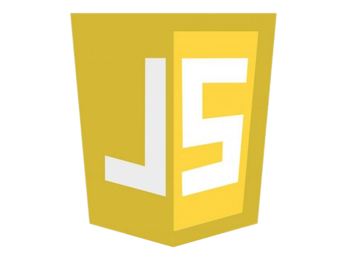

<h1 align="center">Hi 👋, I'm Mohammad Maroof</h1>
<h3 align="center">A passionate Front-End Developer and a College student.</h3>

- 🌱 I’m currently learning **React JS and other Front End Tools**

- 📫 How to reach me **mmaroof487@gmail.com**

<h3 align="left">Languages and Tools:</h3>

<!-- *html -->

<!-- *css -->

<!-- *js -->

<!-- *bs -->

<!-- *tailwind -->

